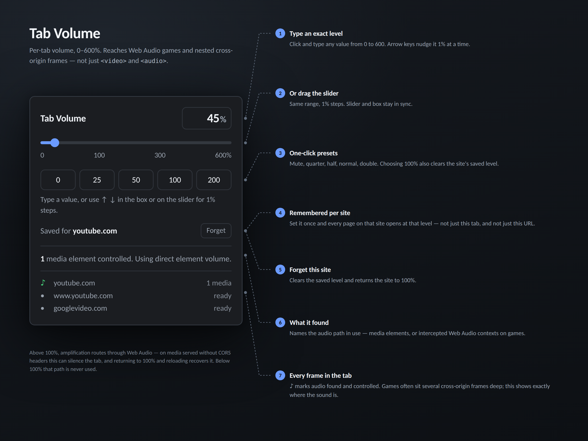

<h1 align="center">
  <br>
  Gainshift
</h1>

<p align="center">
  Per-tab volume control for Firefox, 0–600%.<br>
  Works on Web Audio, not just <code>&lt;video&gt;</code> and <code>&lt;audio&gt;</code>.
</p>

<p align="center">
  <a href="https://addons.mozilla.org/firefox/addon/gainshift/"><b>Install from addons.mozilla.org</b></a>
  &nbsp;·&nbsp;
  <a href="../../issues">Report a site it misses</a>
</p>

---

Firefox can mute a tab. It can't turn one down. Gainshift gives you the level in
between — drop a noisy tab to 25% and leave everything else alone, or push a
quiet one up to 600%.

<p align="center">
  
</p>

## Why this one works where others don't

Most volume extensions go looking for `<video>` and `<audio>` tags. That is fine
on YouTube. It fails on a surprising amount of the web, because plenty of pages
make sound without ever creating one: browser games, emulators and custom players
push audio straight through the Web Audio API, or through `Audio` objects built
in JavaScript and never added to the page at all. On those, a DOM-scanning
extension reports "no audio found" while the page is plainly making noise.

Gainshift works in three places instead:

- the **Web Audio graph**, which is where game and engine audio lives
- ordinary **media elements** in the page
- **detached `Audio` objects**, created in code and never inserted

It also follows audio into nested cross-origin frames, so a game embedded three
or four iframes deep inside a page still answers.

## Below 100%, and above it

These are two different mechanisms, and the difference explains the one real
limitation.

**Below 100%** media elements are turned down through their own `volume`
property, and Web Audio is scaled in the graph. Both are exact multiplications.
No media element is re-routed, nothing is re-encoded, nothing is degraded.

**Above 100%** there is no such shortcut: to make an element louder than its own
maximum, the audio has to be routed through Web Audio and amplified. That works
on most sites. It does not work on media served from another domain without CORS
headers — the browser blocks the route and the tab goes silent instead of loud.
Returning to 100% and reloading recovers it. The panel warns the moment you cross
100%, and names the actual reason if amplification fails.

## Privacy

No network requests of any kind. Nothing is collected, nothing is transmitted,
and there is no analytics, telemetry or server. `storage.local` holds the
hostnames you chose a level for and the number you chose — nothing else, and it
never leaves your browser.

The manifest declares this to Mozilla as `"data_collection_permissions": {
"required": ["none"] }`.

## Building it yourself

There is no compilation step. The `.xpi` is fifteen files in a zip.

```sh
cd src
./build.sh
```

The build is deterministic — timestamps are pinned to `SOURCE_DATE_EPOCH`, `TZ`
to UTC, and the compression level and file order are fixed — so building from a
clean checkout reproduces the published `.xpi` **byte for byte**, same SHA-256.
To prove it against a file you downloaded:

```sh
./build.sh --verify path/to/gainshift.xpi     # prints IDENTICAL (byte for byte)
```

Requirements are `sh` and Info-ZIP `zip`. Node 18+ only if you want the tests.
Full detail in [`src/README.md`](src/README.md).

## Tests

```sh
cd src
./build.sh --test        # or: node test-audio-hook.js, test-background.js, test-popup.js
```

148 assertions, no dependencies — they run the real source in a fresh VM context
against a mock Web Audio API. Every fix is pinned by a test that fails if the fix
is reverted, checked by reverting it rather than assumed.

## Loading it for development

`about:debugging` → *This Firefox* → **Load Temporary Add-on…** → pick
`src/manifest.json`. It goes away when you restart Firefox, and there is a
**Reload** button next to it after you edit a file.

## Known limit

This is interception, not magic. It covers the ways a page normally produces
sound, and those cover a great deal — but something reaching audio by a route
nobody has run into yet would slip past it. If you hit a site where it comes up
empty, [open an issue](../../issues) with the URL; that is exactly the report
worth having.

## Licence

MIT — see [LICENSE](LICENSE).
